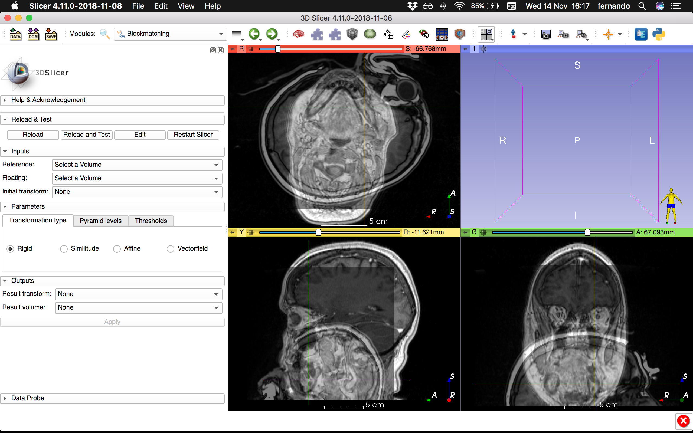
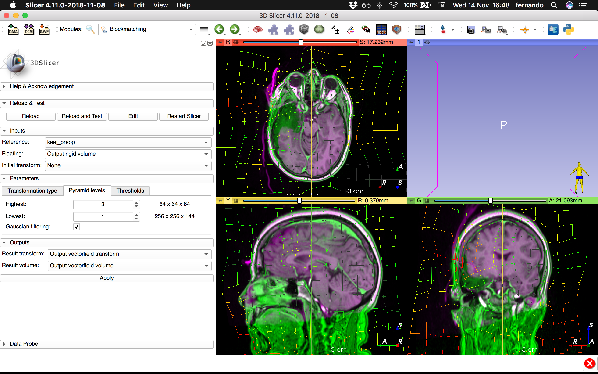

# Blockmatching
[3D Slicer](https://www.slicer.org/) module as a GUI for `blockmatching`.

**Before registration**:


**After registration**:



Assuming `blockmatching` is correctly installed, run in a terminal:
```shell
mkdir -p ~/git
cd ~/git
git clone https://github.com/fepegar/slicer-blockmatching.git
mkdir -p ~/bin
ln -sf $(which blockmatching) ~/bin
```


In `~/.slicerrc.py`:

```python
from os.path import expanduser, splitext, basename

modulePath = expanduser('~/git/slicer-blockmatching/Blockmatching.py')
moduleFactory = slicer.app.moduleManager().factoryManager()
moduleFactory.registerModule(qt.QFileInfo(modulePath))
moduleFactory.loadModules([splitext(basename(modulePath))[0]])
```
